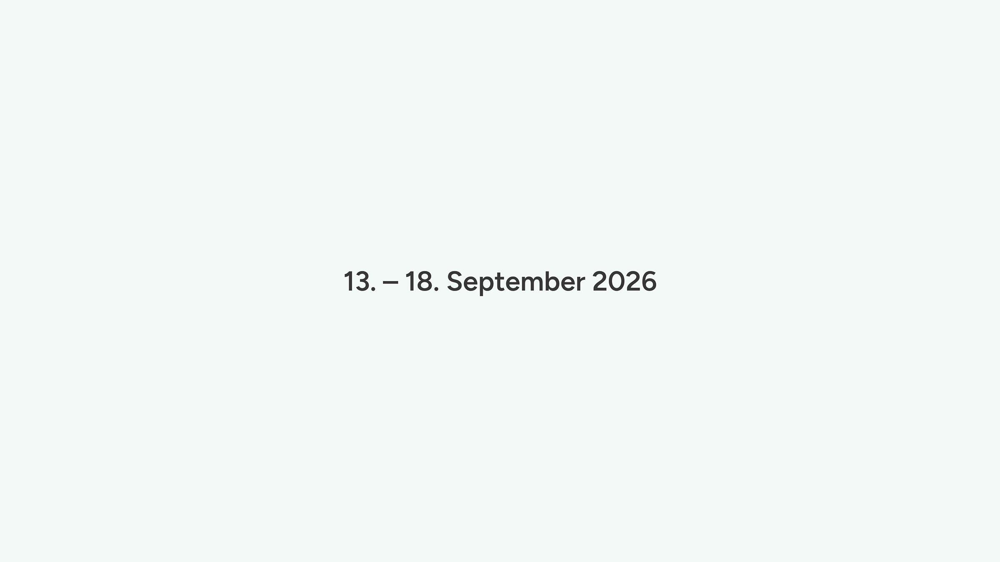

# 📅 DateTime Block

Ein Gutenberg-Block zur einfachen Verwaltung von **Start- und Endzeitpunkten** in Beiträgen, Seiten und Custom Post Types. Ideal für Veranstaltungen, Zeiträume oder geplante Inhalte.


## Funktionen

* Eingabe von **Startdatum** und optionaler **Startzeit**
* Zusätzliche Eingabe von **Enddatum**, **Endzeit** und einem **benutzerdefinierten Anzeigetext**
* Automatische Ausgabe im **deutschen Datumsformat**
* Als `data-start` / `data-end` im HTML eingebettet (z. B. für Filter)
* Speichert Start-/Enddatum auch als **Meta-Felder**:

  * `ud_datetime_block_start`
  * `ud_datetime_block_end`
* Inklusive Vorschau direkt im Editor
* Optional sortierbar in der Admin-Übersicht
* Eingabeformular mit Fokus auf Klarheit und UX

## HTML-Ausgabe
```
<div class="wp-block-ud-datetime-block" data-start="2025-05-22T00:00:00" data-end="2025-05-23T00:00:00"><div class="datetime">22. – 23. Mai 2025</div></div>
```


## Beispiel-Ausgaben

| Eingabe            | Ausgabe                     |
| ------------------ | --------------------------- |
| Nur Startdatum     | `10. Mai 2025`              |
| Start + Startzeit  | `10. Mai 2025 • 9 Uhr`      |
| Start/Enddatum     | `10. – 12. Mai 2025`        |
| Start + Endzeit    | `10. Mai 2025 • 9 – 11 Uhr` |
| Individueller Text | `Freitagmorgen`             |


## Screenshots


*Abbildung: Frontend-Ansicht.*


*Abbildung: Editor-Ansicht.*


## Verzeichnisstruktur

<pre>
ud-datetime-block/

├── package.json              → NPM-Konfiguration: Build-Kommandos, Abhängigkeiten
├── webpack.config.js         → Custom Webpack-Konfiguration (mit Styles und Scripts)
├── block.json                → Block-Metadaten, Attribute, Script- und Stylepfade
├── ud-datetime-block.php     → Einstiegspunkt, lädt alle includes/*

├── includes/                 
│   ├── block-register.php    → Registriert den Block mit register_block_type
│   ├── meta-fields.php       → Registriert Meta-Felder für Start/Ende
│   ├── save-handler.php      → Extrahiert Blockdaten bei Save und speichert in Post-Meta
│   ├── admin-columns.php     → Zusätzliche Spalte in Admin-Übersicht mit Start/Enddatum
│   ├── sort-order.php        → Macht Spalte sortierbar (Startdatum)
│   ├── helpers.php           → Rekursive Blockprüfung und Datums-Extraktion

├── src/
│   ├── css/
│   │   ├── editor.scss       → Styling für Editor
│   │   ├── frontend.scss     → Styling für Frontend (optional)
│   ├── js/
│   │   ├── editor.js         → Einstiegspunkt, lädt Edit/Save-Logik
│   │   ├── edit.js           → Steuert die Block-Oberfläche im Editor
│   │   ├── save.js           → Rendert das gespeicherte HTML mit data-Attributen
│   │   ├── utils/
│   │   │   └── formatDateRange.js → Hilfsfunktion für deutschsprachige Zeitraumanzeige

├── build/                    → Ausgabeordner für kompiliertes CSS/JS
</pre>


## HTML-Ausgabe im Frontend

Der Block gibt folgenden HTML-Code aus:

```html
<div class="wp-block-ud-datetime-block" data-start="2025-05-22T00:00:00" data-end="2025-05-23T00:00:00">
  <div class="datetime">22. – 23. Mai 2025</div>
</div>
```


### Erläuterung:

* **`data-start` / `data-end`**
  → enthalten die vollständigen ISO-Zeitstempel (z. B. `2025-05-22T00:00:00`) und lassen sich für Sortierung, Filter oder JavaScript-Zwecke nutzen.


## Hinweise

* Der Block speichert **zusätzlich** `start` und `end` als Meta-Felder → ideal für Abfragen oder Templates
* Kompatibel mit jedem Custom Post Type (solange `public` = `true`)
* Block ist vollständig valider `block.json`-basiert (API Version 2)


## Beispiel: Beiträge nach Startdatum sortieren

Wenn du Beiträge nach dem im Block definierten Startdatum (`ud_datetime_block_start`) filtern oder sortieren möchtest, kannst du das direkt mit `meta_query` und `orderby` tun:

### Abfrage ab heutigem Datum (z. B. für Veranstaltungen)

```php
$args = [
    'post_type'      => ['post', 'veranstaltung', 'custom_type'],
    'posts_per_page' => 10,
    'meta_key'       => 'ud_datetime_block_start',
    'orderby'        => 'meta_value',
    'order'          => 'ASC',
    'meta_query'     => [
        [
            'key'     => 'ud_datetime_block_start',
            'value'   => date('Y-m-d H:i:s'),
            'compare' => '>=',
            'type'    => 'DATETIME',
        ],
    ],
];

$query = new WP_Query($args);
```

> Ergebnis: Alle Inhalte mit einem zukünftigen Startdatum – sortiert nach dem frühesten Datum.


## Installation

1. Plugin in den Ordner `wp-content/plugins/` legen
2. Per Backend aktivieren
3. Im Gutenberg-Editor den Block **„Datum-Zeit Block“** einfügen