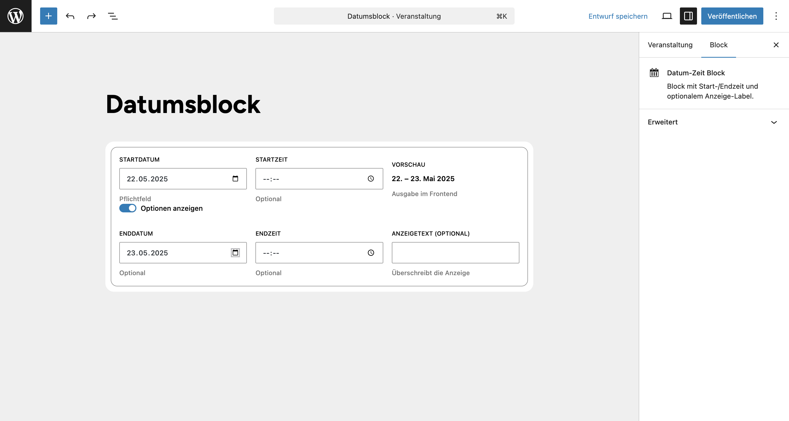

# UD Block: DateTime 

Ein Gutenberg-Block zur einfachen Verwaltung von **Start- und Endzeitpunkten** in Beiträgen, Seiten und Custom Post Types. Ideal für Veranstaltungen, Zeiträume oder geplante Inhalte.

Speichert alle Werte als Meta-Felder und bettet Start-/Enddaten zusätzlich als data-start und data-end im HTML aus, wodurch sich die Daten leicht filtern oder sortieren lassen.

## Funktionen

* Eingabe von **Startdatum** und optionaler **Startzeit**
* Zusätzliche Eingabe von **Enddatum**, **Endzeit** und einem **benutzerdefinierten Anzeigetext**
* Automatische Ausgabe im **deutschen Datumsformat**
* Als `data-start` / `data-end` im HTML eingebettet (z. B. für Filter)
* Speichert Start-/Enddatum auch als **Meta-Felder**:

  * `ud_datetime_block_start`
  * `ud_datetime_block_end`
* Inklusive Vorschau direkt im Editor
* Optional sortierbar in der Admin-Übersicht
* Klare, UX-optimierte Eingabemaske


## Screenshots


*Frontend-Ansicht.*


*Editor-Ansicht.*


## Beispiele und Ausgaben

- Beispielhafte Eingaben und resultierende Ausgaben:

| Eingabe            | Ausgabe                     |
| ------------------ | --------------------------- |
| Nur Startdatum     | `10. Mai 2025`              |
| Start + Startzeit  | `10. Mai 2025 • 9 Uhr`      |
| Start/Enddatum     | `10. – 12. Mai 2025`        |
| Start + Endzeit    | `10. Mai 2025 • 9 – 11 Uhr` |
| Individueller Text | `Freitagmorgen`             |


- HTML-Ausgabe im Frontend

```html
<div class="wp-block-ud-datetime-block" data-start="2025-05-22T00:00:00" data-end="2025-05-23T00:00:00">
  <div class="datetime">22. – 23. Mai 2025</div>
</div>
```

- Die Attribute `data-start` und `data-end` enthalten vollständige ISO-Zeitstempel (z. B. 2025-05-22T00:00:00) und können für Sortierung, Filter oder JavaScript genutzt werden.

- Für Template-Abfragen kann das Meta-Feld `ud_datetime_block_start` wie folgt verwendet werden:
```'meta_query'     => [
    [
        'key'     => 'ud_datetime_block_start',
        'value'   => date('Y-m-d H:i:s'),
        'compare' => '>=',
        'type'    => 'DATETIME',
    ],
]```

### Erläuterung:

* **`data-start` / `data-end`**
  → enthalten die vollständigen ISO-Zeitstempel (z. B. `2025-05-22T00:00:00`) und lassen sich für Sortierung, Filter oder JavaScript-Zwecke nutzen.


## Hinweise

* Der Block speichert **zusätzlich** `start` und `end` als Meta-Felder → ideal für Abfragen oder Templates
* Kompatibel mit jedem Custom Post Type (solange `public` = `true`)
* Block ist vollständig valider `block.json`-basiert (API Version 2)


## Beispiel: Beiträge nach Startdatum sortieren

Wenn du Beiträge nach dem im Block definierten Startdatum (`ud_datetime_block_start`) filtern oder sortieren möchtest, kannst du das direkt mit `meta_query` und `orderby` tun:

### Abfrage ab heutigem Datum (z. B. für Veranstaltungen)

```
    'meta_query'     => [
        [
            'key'     => 'ud_datetime_block_start',
            'value'   => date('Y-m-d H:i:s'),
            'compare' => '>=',
            'type'    => 'DATETIME',
        ],
    ]
```

> Ergebnis: Alle Inhalte mit einem zukünftigen Startdatum – sortiert nach dem frühesten Datum.


## Autor

[ulrich.digital gmbh](https://ulrich.digital)


## Lizenz

GPL v2 or later
[https://www.gnu.org/licenses/gpl-2.0.html](https://www.gnu.org/licenses/gpl-2.0.html)

